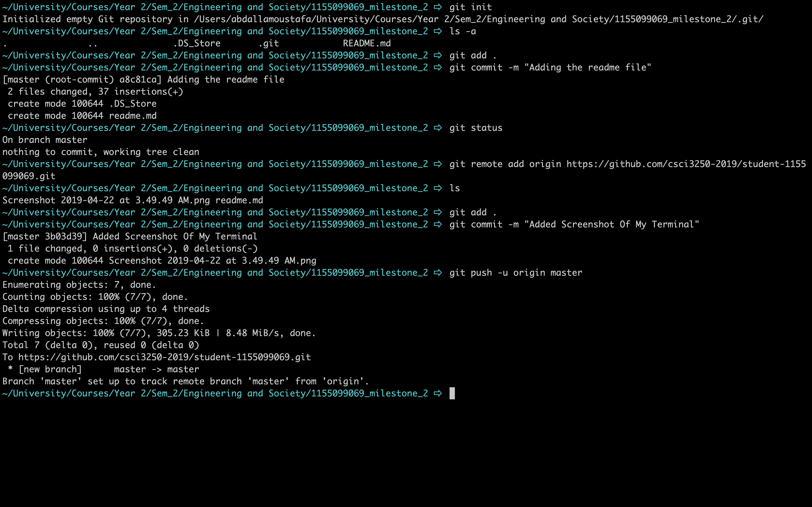

# Student Git Name: Abdalla981

## About me:

Hello, my name is Abdalla Moustafa, a year 2 student majoring in **Computer Science**.

## Hobbies:

I dedicate most of my free time for taking pictures. I have been taking photography as a serious hoby for a couple of years now and I recently shifted my focus more into Videography.

## Experiences Related to CS

I have been working with React framework a lot recently and I'm planning to create a personal website during summer. Apart from that, I have been learning how to use Tensorflow library in python and I intend on learning all the necessary skills both in programming and statistics to create a machine learning model on my own.

This is my first python code:

```python
print("Hello World, our course will start in "):
for x in range(0, 10):
    print((10 - x)):

print("!"):
```

### *Fields I'm interested in:*

1. Computer Vision
2. Artificial Intelligence and Machine Learning
3. Particle Accelerators
4. Space exploration

## Some more info about me:

| Favourite Sport | Favourite Football Team | Favourite Programming Language | Favourite Science |
|-----------------|-------------------------|--------------------------------|-------------------|
| Football        | Barcelona               | Python 3                       | Physics           |

### *Things I'd love to do this year*

- [ ] Get a good internship
- [x] Learn a new programming language or framework (React or Tensorflow)
- [ ] Learn how to grow the appropriate skills to fit in the space exploration industry
- [x] Advance my skills in photography

## Finally, a screenshot that includes all my commands

